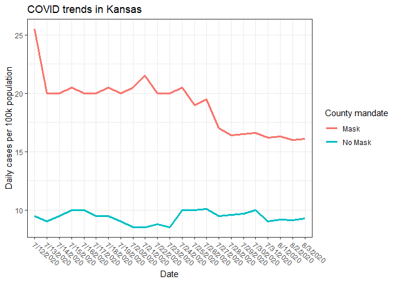

Lab 07 - Conveying the right message through visualisation
================
Ben Hardin
2/21/2023

### Load packages and data

``` r
library(tidyverse) 
```

The original graph is extremely misleading because the two groups (Mask
vs. No Mask) are charted on different y axes with totally different
scales. As a result, 21 cases for a county with a mask mandate is
represented at the same point in the plot as 10 cases for a county with
no mask mandate. This makes it look like both kinds of counties had
roughly the same number of daily cases, but then the number of cases in
Masked counties decreased to be substantially lower than the number of
cases in Un-Masked counties, although this is not what the actual
numbers show.

### Exercise 1

Before we can try to make a more helpful visualization, we need to make
a dataframe replicating (approximately) the data shown in the original
plot.

``` r
covid <- tribble(
~date, ~count, ~mandate,
"7/12/2020", 25.5, "Mask",
"7/12/2020", 9.5, "No Mask",
"7/13/2020", 20, "Mask",
"7/13/2020", 9, "No Mask",
"7/14/2020", 20, "Mask",
"7/14/2020", 9.5, "No Mask",
"7/15/2020", 20.5, "Mask",
"7/15/2020", 10, "No Mask",
"7/16/2020", 20, "Mask",
"7/16/2020", 10, "No Mask",
"7/17/2020", 20, "Mask",
"7/17/2020", 9.5, "No Mask",
"7/18/2020", 20.5, "Mask",
"7/18/2020", 9.5, "No Mask",
"7/19/2020", 20, "Mask",
"7/19/2020", 9, "No Mask",
"7/20/2020", 20.5, "Mask",
"7/20/2020", 8.5, "No Mask",
"7/21/2020", 21.5, "Mask",
"7/21/2020", 8.5, "No Mask",
"7/22/2020", 20, "Mask",
"7/22/2020", 8.75, "No Mask",
"7/23/2020", 20, "Mask",
"7/23/2020", 8.5, "No Mask",
"7/24/2020", 20.5, "Mask",
"7/24/2020", 10, "No Mask",
"7/25/2020", 19, "Mask",
"7/25/2020", 10, "No Mask",
"7/26/2020", 19.5, "Mask",
"7/26/2020", 10.1, "No Mask",
"7/27/2020", 17, "Mask",
"7/27/2020", 9.5, "No Mask",
"7/28/2020", 16.4, "Mask",
"7/28/2020", 9.6, "No Mask",
"7/29/2020", 16.5, "Mask",
"7/29/2020", 9.7, "No Mask",
"7/30/2020", 16.6, "Mask",
"7/30/2020", 10, "No Mask",
"7/31/2020", 16.2, "Mask",
"7/31/2020", 9, "No Mask",
"8/1/2020", 16.3, "Mask",
"8/1/2020", 9.2, "No Mask",
"8/2/2020", 16, "Mask",
"8/2/2020", 9.1, "No Mask",
"8/3/2020", 16.1, "Mask",
"8/3/2020", 9.3, "No Mask"
)
```

### Exercise 2

Now that we have out data, let’s see what the plot looks like when we
plot the data for both masking and non-masking counties on the same
y-axis.

``` r
ggplot(covid, aes(x = date, y = count, group = mandate, color = mandate))+
  geom_line(linewidth = 1.1)+
  theme_bw()+
  theme(axis.text.x = element_text(angle = -40, hjust = -0.05))+
  labs(title = "COVID trends in Kansas",
       y = "Daily cases per 100k population",
       x = "Date",
       color = "County mandate")
```

<!-- -->

### Exercise 3

Compared to the original visualization, this plot more effectively (and
honestly) shows that the counties with no mask mandate have relatively
low and consistent rates of COVID cases; whereas, the counties with mask
mandates have relatively high COVID rates that decrease over time,
although they remain higher than for those with no mask mandate.

### Exercise 4

What the graph tells us is that COVID rates were consistently low in
counties with no mask mandates, and were relatively higher, but
decreased over time in counties with mask mandates. One likely
explanation for this result is that counties that had higher rates of
COVID to start with were the ones that instituted mask mandates, and
those mask mandates have been somewhat effective at reducing the rates
of COVID in those counties.
